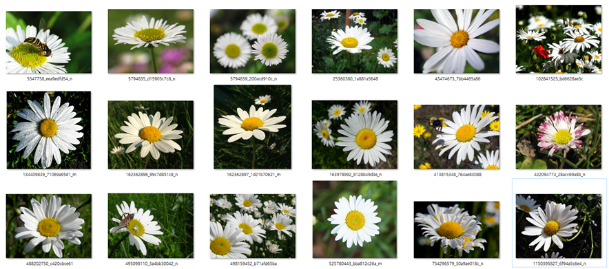
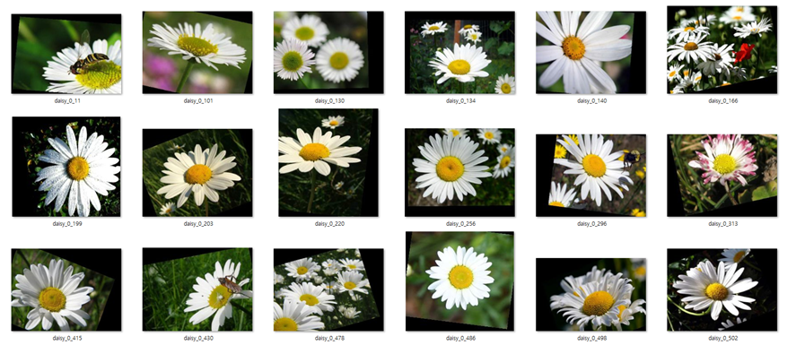
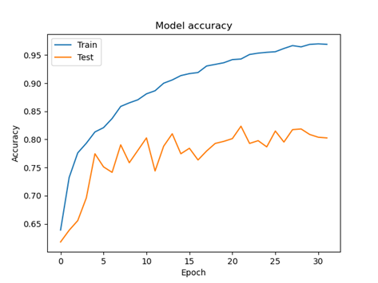
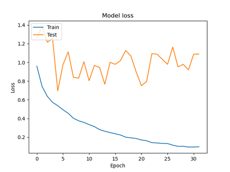

# Groot-AI
I'm Groot 팀 AI Model을 위한 레파지토리

### 꽃 분류 With CNN
CNN : Convolutional Nerual Network

### Model, Image 다운받기
[Model](https://drive.google.com/file/d/1c2vdaoThdqvEJFc6kMGIq72UEFT8HS4q/view?usp=sharing)

[Images](https://drive.google.com/file/d/1K9BiI-k5xqCaIHQgkx74jtXELe0TerZz/view?usp=sharing)

### Tech
- Python Version : 3.7.7
- Keras Version : 2.2.4-tf
- Cuda version : 10.1.243
- OS : Win 10
- GPU : GTX 970

### Images
- Class : 5 (데이지, 장미, 튤립, 민들레, 해바라기)
- Amount : 1903 RGB Images
- Input Size : 224 * 224

### Data

Augmented Images :

### Training
- Train Data Set : About 8700 Augmented RGB Images
- Validation Data Set : About 800 RGB Images
- Batch size : 16
- Epoch : 30
- Taken Time : about 100 min

### Graph

